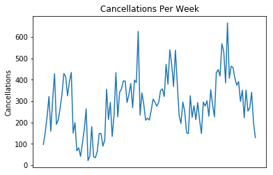
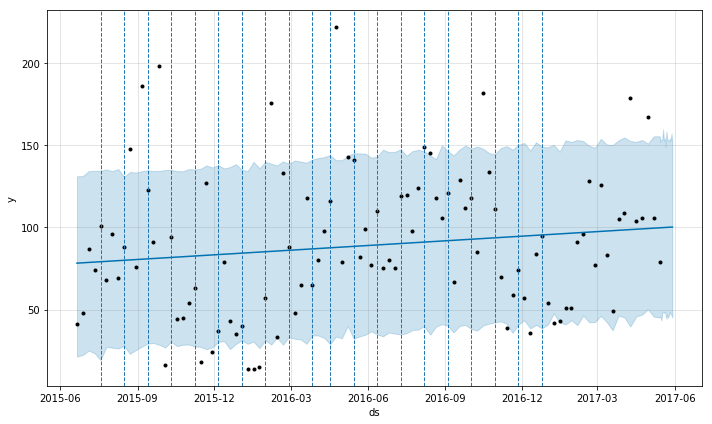
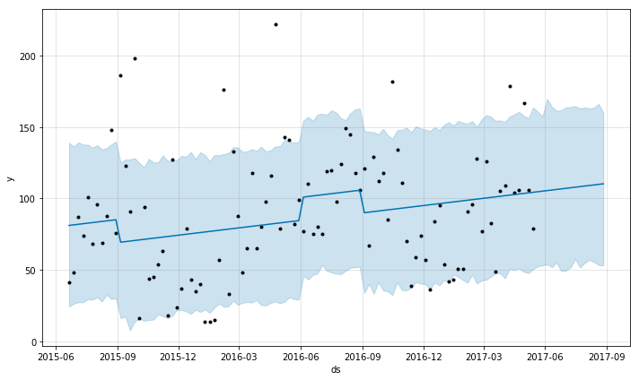
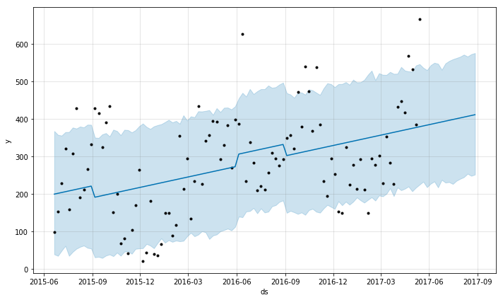

# Using Prophet To Forecast Weekly Hotel Cancellations

Prophet is an open-source time series tool designed by Facebook. The key feature of Prophet is the ability to fit non-linear trends with the effects of seasonality over certain periods (e.g. daily, monthly, weekly), along with holiday effects.

In this example, Prophet is used for the purposes of forecasting fluctuations in the number of hotel cancellations per week for two separate Portuguese hotels, i.e. the models are run on two separate time series.

Both series were split into 100 weeks of training data and 15 weeks of test data.

Here is a visual inspection of the two time series:

### H1


### H2



## Trend Changepoints

One of the advantages of Prophet is being able to automatically detect changes in trend in a time series.

For this example, 20 changepoints are specified for the prediction.

Here is a visual overview of the specified changepoints:



In the first instance, the predictions are generated without any seasonality, i.e. daily, weekly, and yearly seasonality are disabled.

## Holiday months

In addition to specifying changepoints in order to mark shifts in the trend data, Prophet also allows the option for specification of holiday effects, e.g. one would expect that sales for retail stores spike around Christmas time.

In this specific example – it is hypothesised that hotel bookings in Portugal will increase during the summer months (June, July and August), and the number of hotel cancellations will also increase accordingly.

Using Prophet, two models are run:

1.	20 changepoints are assumed, no seasonality is assumed, and no holiday months are specified.
2.	20 changepoints are specified, weekly seasonality is assumed, and the weeks of June, July and August are specified as holiday months for the years 2015 and 2016 (2017 data is not included as it is test data).

## Model 1 (20 Changepoints – No assumed seasonality – No holiday months)

Having previously used ARIMA and LSTM models to forecast weekly hotel cancellations across two Portuguese hotels – the results were a mixed bag.

ARIMA performed well on the first dataset (where hotel cancellations showed more of a trend pattern with less volatility), while the second dataset showed more volatility and greater fluctuations in hotel cancellations.

Therefore, ARIMA and LSTM are used as reference points to compare model performance across three benchmarks:

1.	Mean Directional Accuracy (the extent to which the forecasts accurately predict the direction of the time series; i.e. are hotel cancellations increasing or decreasing).

2.	Root Mean Squared Error (Difference between predicted and observed values)

3.	Mean Absolute Error (Average value of all errors)

### H1 Results

| Reading      | ARIMA | LSTM | Prophet Model 1 |
| ----------- | ----------- | ----------- | ----------- |
| MDA      | 0.86       | 0.8       | 0.86       |
| RMSE   | 57.95        | 64.34       | 52.08       |
| MFE   | -12.72        | -52.22        | 45.69        |

In this instance, it is observed that Prophet outperformed ARIMA and LSTM on an RMSE basis, while ARIMA still showed a lower mean absolute error for the H1 dataset.

### H2 Results

| Reading      | ARIMA | LSTM | Prophet Model 2 |
| ----------- | ----------- | ----------- | ----------- |
| MDA      | 0.86       | 0.8       | 0.86       |
| RMSE   | 274.07        | 92       | 119.27       |
| MFE   | 156.32        | 29.19        | -63.74        |

While ARIMA and Prophet showed a slightly higher MDA, the LSTM model still outperformed these two models on an RMSE and MAE basis.

## Model 2 (20 Changepoints – Weekly Seasonality – Holiday months of June, July and August specified)

An attempt is made to improve the Prophet model performance by specifying weekly seasonality and adding holiday effects.

Given the regular fluctuations week-by-week, it is assumed that weekly seasonality is present in the series.

In this regard, the Prophet model was generated with weekly seasonality = True, along with 20 changepoints being specified.

```
pro_change= Prophet(n_changepoints=20, weekly_seasonality=True)
forecast = pro_change.fit(train_dataset).predict(future)
fig= pro_change.plot(forecast);
a = add_changepoints_to_plot(fig.gca(), pro_change, forecast)
```

In addition to the specified changepoints – an assumption is made that cancellations are more likely to be prevalent during the summer months – where more bookings are likely to be made – and hence a certain proportion of those bookings will be cancelled.

Holiday months are added to the forecast as follows:

```
holiday_months = pd.DataFrame({
  'holiday': 'summer months',
  'ds': pd.to_datetime(['2015-06-21', '2015-06-28', '2015-07-05', '2015-07-12', '2015-07-19', '2015-07-26',
'2015-08-02','2015-08-09','2015-08-16','2015-08-23','2015-08-30','2016-06-05',
'2016-06-12',
'2016-06-19',
'2016-06-26',
'2016-07-03',
'2016-07-10',
'2016-07-17',
'2016-07-24',
'2016-07-31',
'2016-08-07',
'2016-08-14',
'2016-08-21',
'2016-08-28']),
  'lower_window': -1,
  'upper_window': 0,
})

pro_holiday= Prophet(holidays=holiday_months)
pro_holiday.fit(train_dataset)
future_data = pro_holiday.make_future_dataframe(periods=15, freq = 'w')
 
#forecast the data for future data
forecast_data = pro_holiday.predict(future_data)
pro_holiday.plot(forecast_data);
```

## Forecast for Model 1




## Forecast for Model 2



Here are the H1 and H2 Results for the second Prophet model:

(table)

For the H1 dataset, the Prophet model now outperforms both ARIMA and LSTM on an RMSE basis. For H2, the LSTM model still outperforms on an RMSE and MAE basis.

## Conclusion

Facebook’s Prophet library excels when it comes to modelling time series data where:

1)	A significant trend is present
2)	Seasonality needs to be considered
3)	Holiday seasons have a significant impact on fluctuations in the time series

In this regard, configuring the Prophet model for forecasting weekly hotel cancellations showed superior performance to ARIMA and LSTM in certain circumstances, while LSTM still demonstrated superior performance on the second hotel dataset – where time series data was significantly more volatile.

Many thanks for your time!
